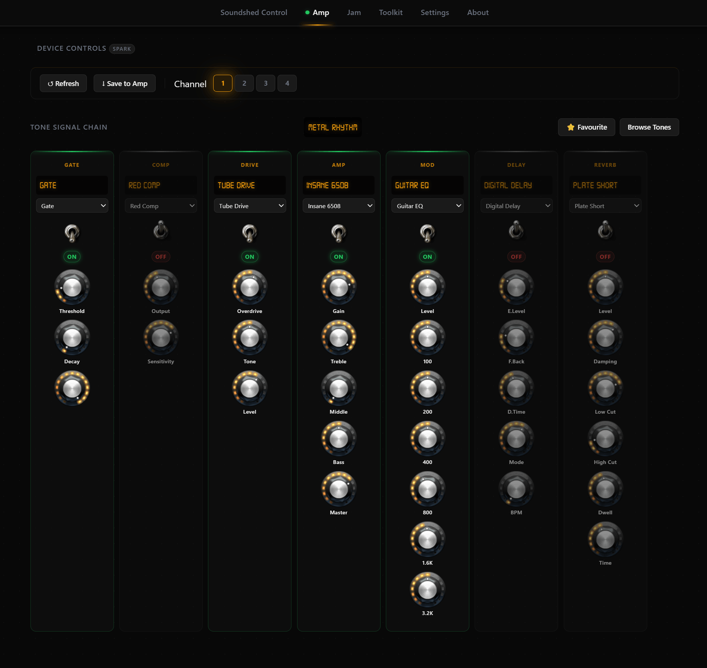

# Soundshed

Desktop UI which can be used to:
- manage tone library and browse tone communities, share tones
- connect to supported amp via bluetooth, manage basic settings and set presets. 
- browse and favourite video backing tracks

Windows, macOS and Linux. Bluetooth connectivity required.

*Supported amps:*
- Positive Grid Spark 40: https://www.positivegrid.com/spark/

### Known Issues
- Device controls (summary level - hidden) not hooked up
- More keyword search/paging etc required
- Amp sometimes returns garbled info
- Invalid settings may crash amp, requiring amp to be switched off and on again.

### Roadmap

- More reliable amp communication
- UI refinements
- Code refactoring and tidy
- More tone community features
- Lessons (community supplied links to video lessons etc)
- artist and song metadata for correct cross reference of tones, backing tracks and lessons.
- If bluetooth serial eventually becomes part of the standard browser API then port to web.

## Build

- Prerequisites: Node JS 14.x or higher, npm 6.14 or higher. Windows, macOS or Linux

- Building the bluetooth-serial-port node module has various requirements depending on the platform you are developing for: https://github.com/tinyprinter/node-bluetooth-serial-port - we are using a custom fork with minor fixes.

- VS Code is the recommended editor

- Clone this repository
- run `npm install` on the repo path

## Run
- Run `npm run watch` in one terminal to continuously rebuild the UI code or `npm run build` to just build once. Note that there is a build for the app UI and a build for the electron main process, some of which use the same files (types etc).
- Run `npm run start` to launch the UI

The final installable app is packaged using electron-forge:
`npm run make`

### Architecture
The app is built using TypeScript, with electron/node as a the host process, talking to the electron renderer and back again (the standard electron way of working). 

The UI is React (TypeScript variant) with bootstrap for UI css. The Pullstate library is use for app state management and a couple of view model classes exist to centralise common points of interaction with APIs, the devices and state.

Communication with the device works by connection/handling serial bluetooth comms events in the main process (electron/node), this then sends an IPC message to the renderer which has listeners in the appViewModel, these then pass relevant data to the react UI. Actions in the UI invoke appViewModel methods which in turn fire IPC messages back to the main process in order to perform bluetooth actions.

Original template is loosely based on https://www.sitepen.com/blog/getting-started-with-electron-typescript-react-and-webpack

